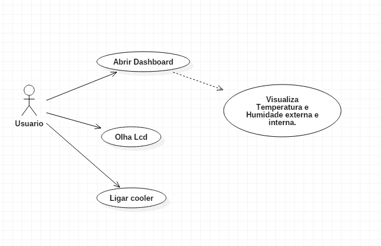

# Casos de uso

## 1. Diagrama de casos de uso

## 2. Especificação dos casos de uso

### 2.1. Caso de uso **REGISTRAR CHAMADO**

| Campo          | Informação        |
|---|---|
| Identificador: | UC01              |
| Nome:          | Abrir dashboard |
| Atores:        | Membros Usuario |
| Sumário:       | Verifica Temperatura e humidade liga Coller |

| Fluxo Principal |
|---|
| 1) Entra no dashboard e verifica os dados de temperatura e humidade externos e internos |
| 2) Liga o cooler                 |
| 3) O Sistema liga o cooler  |
| 4) Desliga coller |
| 5) O sistema Desliga cooler. |

| Fluxo Alternativo (2a): O sistema não encontra as informações do cliente pelo CPF. |
|---|
| 1) O sistema Informa a temperatura e a monitora  |
| 2) Usuario desliga cooler por muito humidade no ar |
| 3) O sistema desliga Cooler|

