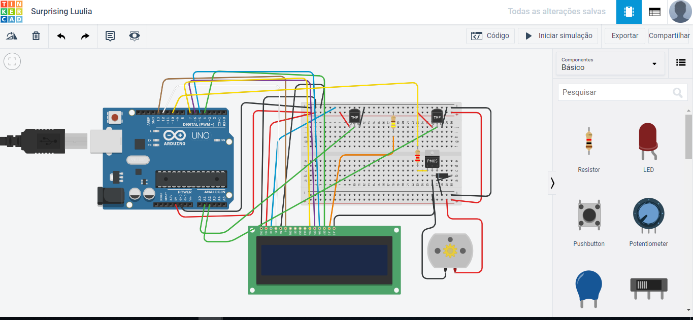
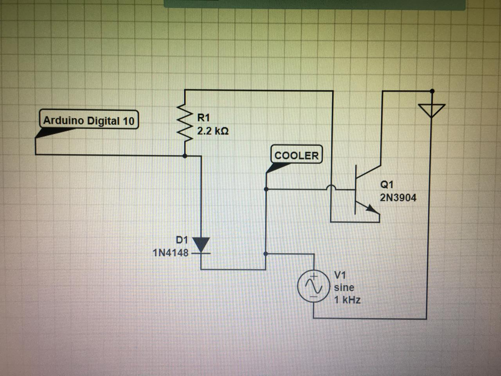

# Descriçao do Hardware

Deve conter:

1)Lista de Peças (descrição e imagens, quando disponíveis)

* 2 - Sensor de umidade e temperatura DHT11
* Arduino UNO
* resistores de 2k2
* Transistor TIP41C
* Diodo
* LCD 16x2
* Cooler

2) Desenho Tinkercad ou Fritzing

3) Esquema eletrônico

4) Materiais para confecção de caixas e consoles (ou arquivos para impressão 3D)
   * chapa de Pcv 
   * 200 palitos de fibra de vidro
   * Fibra de celulose
   * Coller
   * Caixa Para colocar agua
   * Filtro montado com bribra de vidro e fibra de celulose
